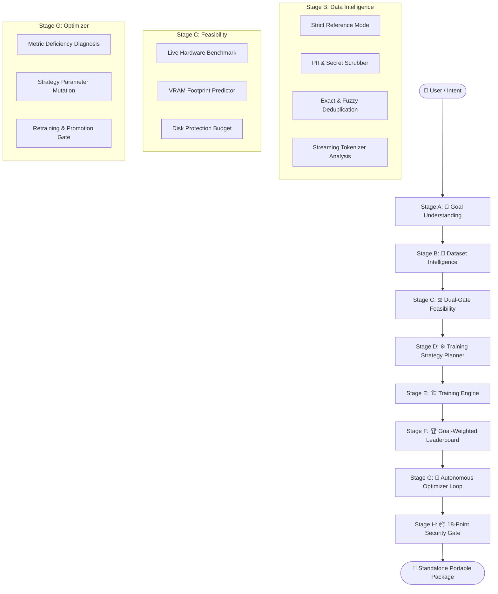

# 🏛️ MYAI Architecture

## 🎯 Executive Overview

**MYAI** is a local-first autonomous AI model builder and packager. It converts user intent and raw datasets into high-performance, goal-aligned, fine-tuned language models packaged as standalone, zero-dependency distributions with built-in Web & CLI chat runtimes.



---

## 🏗️ System Decomposition

MYAI is structured into **seven decoupled architectural layers**:

```text
┌────────────────────────────────────────────────────────┐
│                   CLI / INTERACTION                    │
│      Commands: init · data · recommend · train ·       │
│             optimize · auto · export · serve           │
└──────────────────────────┬─────────────────────────────┘
                           ▼
┌────────────────────────────────────────────────────────┐
│              AUTONOMOUS ORCHESTRATION                  │
│       Autopilot · Project State Machine · Workflows    │
└──────────────────────────┬─────────────────────────────┘
                           ▼
┌────────────────────────────────────────────────────────┐
│               INTELLIGENCE & REASONING                 │
│   Goal-Weighted Matrices · Recommender · Optimizer     │
└──────────────────────────┬─────────────────────────────┘
                           ▼
┌────────────────────────────────────────────────────────┐
│              DATA & TOKENIZATION ENGINE                │
│    Reference Mode Scanner · Cleaning · Streaming       │
│           Model-Aware Tokenizer Analyzers              │
└──────────────────────────┬─────────────────────────────┘
                           ▼
┌────────────────────────────────────────────────────────┐
│            HARDWARE BENCHMARK & FEASIBILITY            │
│    Throughput Prober · Empirical VRAM Footprint Model  │
└──────────────────────────┬─────────────────────────────┘
                           ▼
┌────────────────────────────────────────────────────────┐
│               TRAINING & EVALUATION ENGINE             │
│    LoRA/QLoRA Fine-Tuning · Live Loss · Checkpointing  │
│        BLEU · ROUGE · Readability · Domain Accuracy    │
└──────────────────────────┬─────────────────────────────┘
                           ▼
┌────────────────────────────────────────────────────────┐
│          18-POINT SECURITY GATE & PACKAGING            │
│   Zero-Framework ZIP Runtime · Luminous Chat UI (Web)  │
└────────────────────────────────────────────────────────┘
```

---

## 🔬 Core Subsystems

### 1. 🎯 Goal Understanding & Composite Metric Weighting (Stage A)
* **Goal Capture**: Translates interactive user intent (e.g. `domain-qa / fitness`) into formal metric weights.
* **Evaluation Matrix**: Replaces generic averages with goal-weighted composite score formulas:
  $$\text{Score}_{\text{composite}} = \sum_{i} w_i \cdot M_i$$
  where $M_i \in \{\text{BLEU}, \text{ROUGE}, \text{Domain Accuracy}, \text{Readability}, \text{Exact Match}\}$.

### 2. 🧹 Dataset Intelligence & Tokenizer Analysis (Stage B)
* **Strict Reference Mode**: Never copies, alters, or moves raw source files. Operates strictly read-only ($MD5_{\text{before}} = MD5_{\text{after}}$).
* **Streaming Tokenizer Engine**: Resolves exact token boundaries per base model family (`Qwen`, `Llama`, `SmolLM`) without memory exhaustion.
* **Automated Data Cleaning**: Scans and strips API keys (`sk-`, `ghp_`, `hf_`, `AKIA`), emails, and phone numbers. Applies SequenceMatcher exact/fuzzy deduplication and train/val contamination isolation.

### 3. ⚖️ Dual-Gate Feasibility & Hardware Prober (Stage C)
* **Live Throughput Benchmark**: Measures actual forward/backward throughput to determine the compute tier (`T0` to `T3`).
* **VRAM Modeling**: Computes exact memory requirements:
  $$\text{VRAM}_{\text{total}} = V_{\text{base}} + V_{\text{KV}} + V_{\text{act}} + V_{\text{LoRA}} + V_{\text{CUDA\_headroom}}$$
* **Closed-Loop Auto-Downgrade**: Automatically switches to 4-bit precision, enables gradient checkpointing, or caps sequence length if hardware limits are exceeded.

### 4. 🏆 Goal-Weighted Experiment Leaderboard (Stage D)
* **Historical Run Tracking**: Persists evaluation metrics and training configurations across all experiments.
* **Regression Stability Gate**: Halves scores for regressed models and blocks them from becoming Release Candidates.

### 5. 🔧 Autonomous Optimizer Loop (Stage E)
* **Deficiency Diagnostics**: Pinpoints underperforming metrics in the active Release Candidate.
* **Prescriptive Mutation**: Generates targeted hyperparameter adjustments (learning rate, LoRA rank/alpha, batch size, sequence length).
* **Promotion Rule**: Evaluates candidate runs and promotes them only if improvement meets the threshold ($\Delta \ge \text{min\_delta}$) without regression.

### 6. 📦 18-Point Containment Gate & Zero-Dependency Packager (Stage H)
* Validates every export against strict anti-leakage rules:
  * Zero MYAI framework source code included.
  * Zero `.git/`, `.env`, raw datasets, or credentials.
  * Zero path-traversal entries.
* Emits a standalone distribution package with an embedded **Luminous Web & CLI Chat UI** running on native Python `http.server`.

---

## 🔒 Security & Privacy Architecture

* **100% Air-Gapped Capable**: All tokenizer fallbacks, cleaning routines, training engines, and inference runtimes operate entirely offline without network access.
* **No Telemetry**: Zero analytics, telemetry, or remote API logging.
* **Non-Destructive Storage**: Derived artifacts live in project-local `.myai/` folders and can be purged safely at any time.
