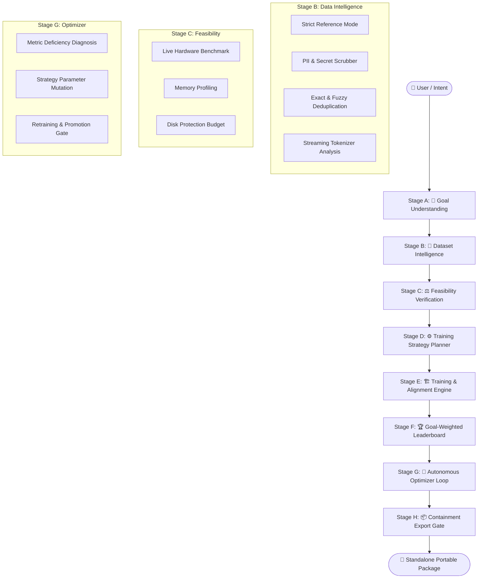

# 🏛️ MYAI Architecture

## 🎯 Executive Overview

**MYAI** is a local-first autonomous AI model builder and packager. It converts user intent and raw datasets into high-performance, goal-aligned language models packaged as standalone, zero-dependency distributions with built-in Web & CLI chat runtimes.



---

## 🏗️ System Decomposition

MYAI is structured into **seven decoupled architectural layers**:

```text
┌────────────────────────────────────────────────────────┐
│                   CLI / INTERACTION                    │
│      Commands: init · data · recommend · train ·       │
│             optimize · auto · export · serve           │
└──────────────────────────┬─────────────────────────────┘
                           ▼
┌────────────────────────────────────────────────────────┐
│              AUTONOMOUS ORCHESTRATION                  │
│       Autopilot · Project State Machine · Workflows    │
└──────────────────────────┬─────────────────────────────┘
                           ▼
┌────────────────────────────────────────────────────────┐
│               INTELLIGENCE & REASONING                 │
│   Goal-Weighted Matrices · Recommender · Optimizer     │
└──────────────────────────┬─────────────────────────────┘
                           ▼
┌────────────────────────────────────────────────────────┐
│              DATA & TOKENIZATION ENGINE                │
│    Reference Mode Scanner · Cleaning · Streaming       │
│           Model-Aware Tokenizer Analyzers              │
└──────────────────────────┬─────────────────────────────┘
                           ▼
┌────────────────────────────────────────────────────────┐
│            HARDWARE BENCHMARK & FEASIBILITY            │
│       Throughput Prober · Dynamic Memory Profiler      │
└──────────────────────────┬─────────────────────────────┘
                           ▼
┌────────────────────────────────────────────────────────┐
│               TRAINING & EVALUATION ENGINE             │
│    LoRA/QLoRA Fine-Tuning · Live Loss · Checkpointing  │
│        BLEU · ROUGE · Readability · Domain Accuracy    │
└──────────────────────────┬─────────────────────────────┘
                           ▼
┌────────────────────────────────────────────────────────┐
│             EXPORT CONTAINMENT & PACKAGING             │
│   Zero-Framework ZIP Runtime · Luminous Chat UI (Web)  │
└────────────────────────────────────────────────────────┘
```

---

## 🔬 Core Subsystems

### 1. 🎯 Goal Understanding & Composite Metric Weighting (Stage A)
- **Goal Capture**: Translates interactive user intent (e.g. `domain-qa / fitness`) into formal metric weights.
- **Evaluation Matrix**: Replaces generic averages with goal-weighted composite scoring aligned with your specific task criteria (BLEU, ROUGE, Domain Accuracy, Readability, Exact Match).

### 2. 🧹 Dataset Intelligence & Tokenizer Analysis (Stage B)
- **Strict Reference Mode**: Operates in read-only mode on original dataset files without in-place modification.
- **Streaming Tokenizer Engine**: Computes exact token distributions across supported base model families (`Qwen`, `Llama`, `SmolLM`).
- **Automated Data Cleaning**: Detects and sanitizes API keys, credentials, and contact details, applying deduplication and train/val contamination checks.

### 3. ⚖️ Feasibility Verification & Hardware Profiling (Stage C)
- **Hardware Probing**: Measures execution throughput and categorizes hardware environments into compute tiers (`T0` to `T3`).
- **Memory Profiling**: Proactively evaluates memory headroom across model sizes, quantization types, and batch configurations.
- **Adaptive Execution**: Automatically applies memory optimization strategies (4-bit quantization, gradient checkpointing, layer streaming) when running on constrained hardware.

### 4. 🏆 Goal-Weighted Experiment Leaderboard (Stage D)
- **Historical Run Tracking**: Persists evaluation metrics and training configurations across all runs.
- **Stability Gating**: Ensures model checkpoints meet regression stability criteria before becoming Release Candidates.

### 5. 🔧 Autonomous Optimizer Loop (Stage E)
- **Deficiency Diagnostics**: Identifies underperforming metrics in active candidate models.
- **Prescriptive Mutation**: Suggests targeted parameter adjustments (learning rate, adapter rank/alpha, batch size).
- **Promotion Rule**: Evaluates retrained runs and promotes new candidates only when measurable improvements are verified.

### 6. 📦 Containment Export Gate & Zero-Dependency Packager (Stage H)
- Validates every export against strict containment criteria:
  - Excludes internal framework source code and `.git/` history.
  - Excludes sensitive environment files and raw training datasets.
  - Prevents path-traversal entries.
- Produces a standalone distribution package with an embedded **Luminous Web & CLI Chat UI** running on native Python `http.server`.

---

## 🔒 Security & Privacy Design

- **Local-First Execution**: Tokenization, data processing, training, and inference run on local hardware without mandatory cloud telemetry.
- **Non-Destructive Storage**: Derived artifacts are maintained in project-local directories and can be inspected or purged at any time.
