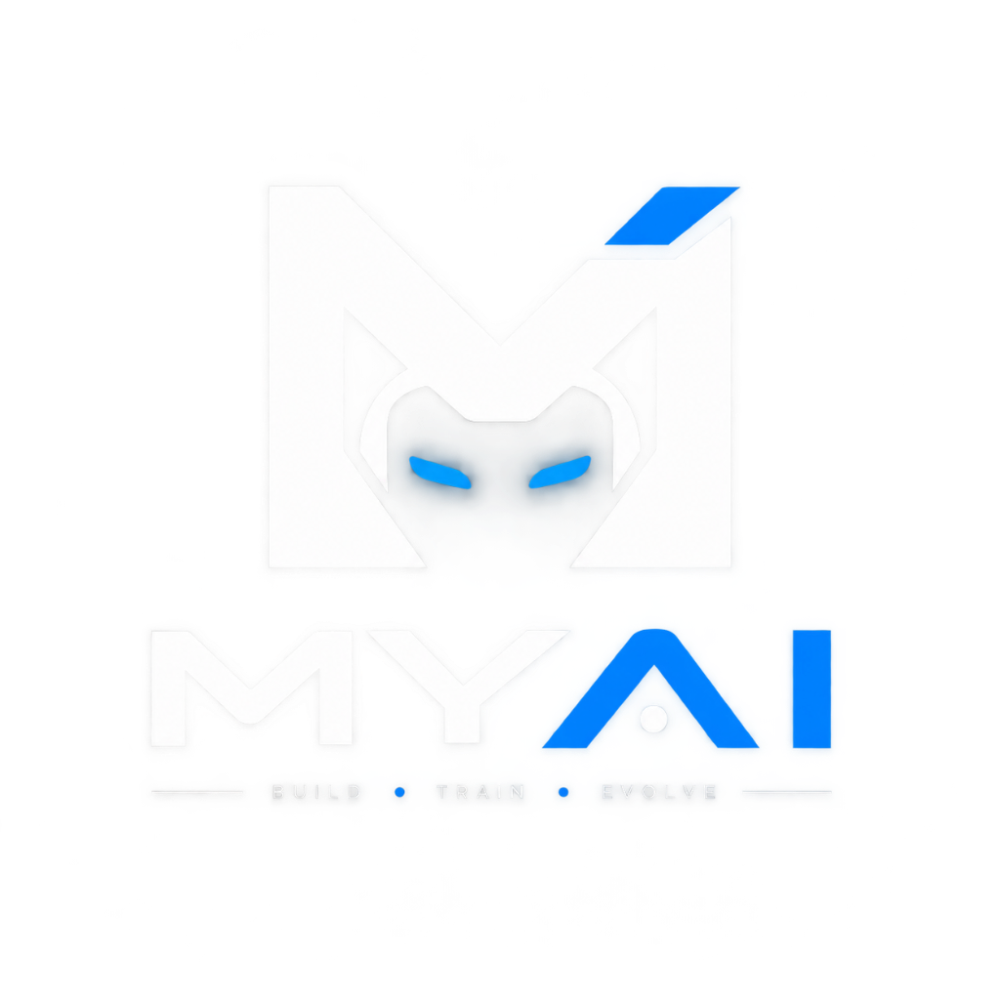
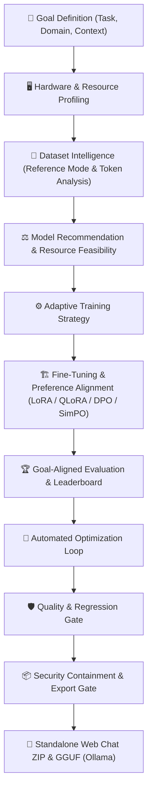

<!-- markdownlint-disable MD033 -->
<p align="center">
  
</p>

<h1 align="center">MYAI</h1>

<p align="center">
  <strong>The Local-First Autonomous AI Model Builder & Standalone Runtime Packager.</strong><br>
  <em>BUILD · TRAIN · EVOLVE</em>
</p>

<p align="center">
  <a href="#-quickstart-in-3-commands">Quickstart</a> &middot;
  <a href="#-why-myai">Why MYAI?</a> &middot;
  <a href="#-key-capabilities">Capabilities</a> &middot;
  <a href="#-hardware-tiers--supported-models">Hardware & Models</a> &middot;
  <a href="#-step-by-step-workflow-guide">Workflow Guide</a> &middot;
  <a href="#-standalone-runtime-export">Standalone Runtime</a> &middot;
  <a href="#-complete-cli-reference">CLI Reference</a> &middot;
  <a href="#-security--containment-policies">Security & Privacy</a>
</p>

<p align="center">
  <a href="https://github.com/kiransai-62/myai"></a>
  <a href="LICENSE"></a>
  <a href="docs/hardware_catalog.md"></a>
  <a href="#-post-training-preference-alignment"></a>
  <a href="#-security--containment-policies"></a>
  
</p>

---

Tell MYAI what AI you want. MYAI analyzes your **goal**, your **hardware**, and your **data** — then helps build, evaluate, optimize, and package your custom model into a standalone, portable runtime with its own Web & CLI Chat UI, or exports it to GGUF format for Ollama and `llama.cpp`.

> **No cloud GPUs required. Local data privacy. No framework lock-in.**

---

## ⚡ Quickstart in 3 Commands

```bash
# 1. Initialize in current directory (or create a subfolder with 'myai init <name>')
myai init .

# 2. Add your dataset in-place (JSONL, JSON, CSV, TXT, Parquet)
myai data add <path/to-data>      # e.g., ./coaching_data.jsonl

# 3. Autopilot: Goal → Hardware & Data → Train → Eval → Optimize → Export
myai auto --export
```

### 🖥️ Autopilot Workflow Overview

```text
Goal Specification
       ↓
Hardware & Data Analysis
       ↓
Model Recommendation
       ↓
Fine-Tuning & Alignment
       ↓
Evaluation & Verification
       ↓
Hyperparameter Optimization
       ↓
Security & Containment Gate
       ↓
Standalone Export & Deployment
```

---

## 💡 Why MYAI?

Building, evaluating, and packaging fine-tuned LLMs has traditionally been fragmented across ad-hoc scripts, CUDA out-of-memory errors, disconnected evaluation tools, and bulky serving setups. MYAI unifies the entire stack into an **autonomous, local-first platform**:

| Feature | Description |
| :--- | :--- |
| 🔒 **Local-First & Private** | Compute, tokenization, training, and evaluation run on your local machine with no external cloud telemetry. |
| 🌊 **Memory-Efficient Training** | Adaptive layer streaming enables fine-tuning on budget and laptop GPUs. |
| 🖥️ **Hardware-Aware Intelligence** | Analyzes system CPU, RAM, and GPU/VRAM to match feasible models and context windows. |
| 🎯 **Post-Training Alignment** | Preference optimization supporting **DPO, ORPO, SimPO, and KTO**. |
| 🧠 **Automated Task Verification** | Evaluates model outputs against task criteria and reference datasets. |
| 🛡️ **Regression Quality Gate** | Bundled offline test suites (format compliance, tool calling, arithmetic, safety) issuing automated SHIP / DON'T-SHIP verdicts. |
| 📦 **Standalone Runtime Exports** | Self-contained ZIP packages containing a built-in Web Chat UI, GGUF format for Ollama, and merged weight checkpoints. |

---

## 🌟 Key Capabilities



### 1. 🎯 Goal-Aligned Planning
Define your AI's task and domain (`chat`, `code`, `domain-qa`, `summarization`, `extraction`, `reasoning`). MYAI tailors evaluation criteria so performance is measured directly against your specific objective.

### 2. 🧹 Dataset Intelligence & Strict Reference Mode
* **Strict Reference Mode**: Original data files are **never modified in-place**.
* **PII & Secret Scrubbing**: Automated detection and redaction of sensitive strings (emails, phone numbers, API keys).
* **Deduplication**: Identifies and removes duplicate and near-duplicate samples.
* **Leakage Detection**: Isolates train and validation sets before training begins.

### 3. 🔬 Token & Context Analysis
* Computes token counts and sequence distributions across supported model families (Llama, Qwen, SmolLM).
* Flags context length mismatches and memory considerations prior to training.

### 4. 🌊 Memory-Efficient Training
Enables fine-tuning on resource-constrained GPUs via memory-optimized layer streaming.

### 5. 🧬 Post-Training Preference Alignment
Fine-tune beyond standard supervised training with modern preference alignment algorithms:
* **DPO** (Direct Preference Optimization)
* **ORPO** (Odds Ratio Preference Optimization — reference-model-free)
* **SimPO** (Simple Preference Optimization — length-normalized margin)
* **KTO** (Kahneman-Tversky Optimization — binary feedback)

### 6. 🛡️ Quality Gate & Containment Verification
* Validates fine-tuned checkpoints against regression suites before release (`myai ship`).
* Enforces containment checks (excludes internal source files, `.git`, `.env`, raw datasets, and traversal paths) before packaging.

---

## 🖥️ Hardware Tiers & Supported Models

### Hardware-Aware Feasibility
MYAI evaluates your local hardware capacity (CPU, system RAM, and GPU VRAM) to recommend suitable models and training configurations:

* **Capacity-Matched Recommendations**: Recommends models based on your hardware, data, task, and deployment requirements.
* **Headroom Feasibility**: Checks available memory headroom across operating context lengths.
* **Clear Readiness Verdicts**: Provides clear guidance on whether a model is recommended, compatible, or requires reduced context/quantization.

### Compute Tiers Overview

| Hardware Tier | Memory Profile | Example Hardware | Supported Models |
| :--- | :--- | :--- | :--- |
| **Tier T0 (CPU Only)** | 8GB–32GB Host RAM | Intel Core / AMD Ryzen / Apple Silicon | SmolLM2 (135M–1.7B), Qwen 2.5 (0.5B–1.5B) |
| **Tier T1 (Low VRAM)** | **4GB–6GB VRAM** | GTX 1650, RTX 3050 Laptop | SmolLM2, Qwen 2.5 (1.5B/3B), Gemma 3 (1B/4B), 8B (Streaming) |
| **Tier T2 (Mid VRAM)** | **8GB–16GB VRAM** | RTX 3060, RTX 4070, Apple M-Series | Llama 3.1 (8B), Qwen 2.5 (7B/14B), Phi-4 (14B), Ministral (8B) |
| **Tier T3 (High VRAM)** | **24GB+ VRAM** | RTX 3090, RTX 4090, A100, H100 | Mistral Small (24B), Qwen 2.5 (32B), Llama 3.1 (70B) |

### Supported Model Families

MYAI supports leading open-weight model architectures spanning **0.1B to 70B+** parameters:

| Model Family | Representative Sizes | Architecture | Quantization Formats | Primary Strengths |
| :--- | :--- | :--- | :---: | :--- |
| **SmolLM2** | 135M, 360M, 1.7B | Dense | FP16, INT8, Q4_K_M | Ultra-lightweight on-device assistants, edge devices |
| **Qwen 2.5 / 3** | 0.5B, 1.5B, 3B, 7B, 14B, 32B | Dense & MoE | FP16, FP8, AWQ, GPTQ, Q4_K_M | Multilingual instruction following, coding, reasoning |
| **Llama 3.1 / 3.2** | 1B, 3B, 8B, 70B | Dense | FP16, BF16, Q4_K_M, INT8 | General reasoning, tool calling, instruction tuning |
| **Gemma 3** | 270M, 1B, 4B, 12B | Dense | FP16, BF16, Q4_K_M | Mathematical reasoning, high-efficiency generation |
| **Mistral / Ministral** | 3B, 8B, 14B, 24B | Dense & MoE | FP16, FP8, AWQ, Q4_K_M | Code generation, reasoning, efficient MoE |
| **Phi-4** | 3.8B (Mini), 14B | Dense | FP16, BF16, Q4_K_M | Advanced STEM reasoning, logic, and extraction |
| **DeepSeek (R1 Distill)** | 7B, 32B | Dense | FP16, Q4_K_M, AWQ | Deep analytical reasoning, math, and code synthesis |

---

## 🧭 Step-by-Step Workflow Guide

### 1. Initialize Project & Goal
```bash
myai init fitness-coach --task domain-qa --domain fitness --context balanced
cd fitness-coach
```

### 2. Register & Clean Data
```bash
# Register dataset source in Reference Mode and inspect token distribution
myai data add ./coaching_data.jsonl

# Clean dataset, redact PII, deduplicate, and create holdout validation set
myai data clean --fuzzy --val-split 0.1
```

### 3. Model Recommendation & System Check
```bash
# Verify local hardware availability
myai system check

# Get goal- and hardware-aware base model recommendation
myai recommend
```

### 4. Fine-Tuning & Alignment
```bash
# Standard QLoRA fine-tuning
myai train --epochs 3 --lr 2e-4

# Fine-tune with memory streaming on low-VRAM hardware
myai train --stream-layers

# Direct preference alignment (SimPO, DPO, ORPO, or KTO)
myai train --task simpo
```

### 5. Automated Verification & Quality Gate
```bash
# Generate task-specific verifiers from reference data
myai reward synth ./data/references.jsonl -o reward.py

# Execute regression gate before release
myai ship
```

### 6. Export Standalone Package
```bash
# Export standalone Web Chat ZIP
myai export

# Export GGUF format for Ollama / llama.cpp
myai export --format gguf --quant q4_k_m

# Merge adapter weights into base model checkpoint
myai merge
```

---

## 🚀 Standalone Runtime Export

The exported `.zip` contains a self-contained runtime that can run independently without requiring the full MYAI development CLI:

```text
fitness-coach.myai.zip
├── model/                  # Model / adapter weights
├── tokenizer/              # Tokenizer config and vocabulary
├── metadata.json           # Model provenance, base repo, and goal profile
├── evaluation.json         # Evaluation metrics and gate verification status
├── loader.py               # Lightweight inference loader
└── chat/
    ├── app.py              # Lightweight web server (built-in http.server)
    ├── ui.py               # Terminal fallback chat interface
    ├── config.json         # UI configuration & styling
    └── web/
        └── index.html      # Responsive Web Chat interface
```

### Launch Web Chat Interface
```bash
python chat/app.py
```
* Runs on Python's standard library `http.server` with zero external web framework dependencies.
* Responsive, dark-mode browser interface.
* Includes real-time streaming, parameter controls, token counters, and message history.

---

## 🛡️ Security & Containment Policies

Artifacts produced by `myai export` follow strict automated packaging and containment checks:

| Policy Area | Verification Scope | Description |
| :--- | :--- | :--- |
| **Integrity** | Package Structure | Verifies archive integrity, weight files, and tokenizer configurations. |
| **Provenance** | Manifest Audit | Records base model origin, training configurations, and holdout evaluation metrics. |
| **Runtime Isolation** | Portable Delivery | Bundles standalone `loader.py` and lightweight Web Chat runtime. |
| **Containment** | Source Isolation | Excludes development source files and `.git/` history from release packages. |
| **Data Privacy** | Secret & Data Scrubbing | Checks for sensitive credentials (`sk-`, `ghp_`, `hf_`, `AKIA`) and excludes raw training files. |
| **Path Security** | Traversal Protection | Prevents absolute host paths and relative directory traversals (`../`). |

---

## 🛠️ Complete CLI Reference

| Command Group | Command | Description |
| :--- | :--- | :--- |
| **Project** | `myai init [name]` | Initialize project workspace with interactive Goal Profile interview |
| | `myai status` | Inspect project lifecycle state and recommended next steps |
| | `myai system check` | Probe local CPU, RAM, GPU, VRAM, and compute tier |
| | `myai system benchmark` | Benchmark live hardware compute and memory throughput |
| **Autopilot** | `myai auto [--export]` | **Autonomous Pipeline**: Goal → Hardware & Data → Train → Eval → Optimize → Export |
| **Data** | `myai data add <path>` | Register local datasets in Reference Mode and analyze token distributions |
| | `myai data tokenize` | Inspect token counts, sequence lengths, and context fit |
| | `myai data clean` | Clean, deduplicate, scrub sensitive data, and split train/val sets |
| | `myai data list` / `info` | View registered datasets, sample counts, and quality metrics |
| **Models** | `myai model list` | Browse supported model catalog (Dense, MoE, size, VRAM requirements) |
| | `myai model use <id>` | Select active base model for the project |
| | `myai recommend` | Hardware- and goal-aware recommendation with multi-factor suitability |
| **Training** | `myai train` | Train model with live loss curves and progress telemetry |
| | `myai train --stream-layers` | Train on resource-constrained GPUs using memory streaming |
| | `myai train --task <method>` | Train preference alignment (**DPO, ORPO, SimPO, KTO**) |
| **Alignment** | `myai reward synth` | Generate task-specific verifiers from reference datasets |
| | `myai ship` | Run regression gate and test suites for release verdict |
| | `myai merge` | Merge adapter weights into base model checkpoint |
| **Tracking** | `myai runs list` / `info <id>` | List historical training runs and metric summaries |
| | `myai runs best` | View experiment leaderboard and current release candidate |
| | `myai optimize` | Automated retrain and compare hyperparameter optimization loop |
| **Export** | `myai export [--format]` | Package as standalone Web App ZIP, **GGUF (Ollama)**, or Merged weights |
| **Serving** | `myai serve` / `myai ask` | Serve local model with Knowledge Gate RAG protection |

---

## 📜 License

Distributed under the **Apache 2.0** License. See [LICENSE](LICENSE) for details.
