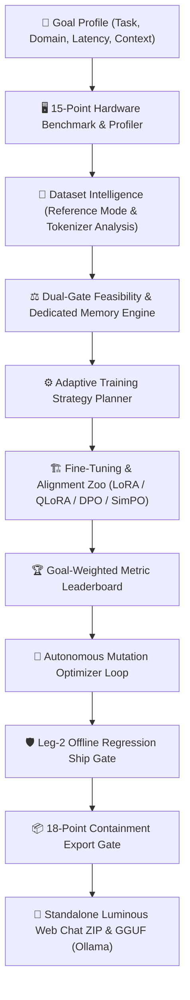

<p align="center">
  
</p>

<h1 align="center">MYAI</h1>

<p align="center">
  <strong>The Local-First Autonomous AI Model Builder & Zero-Dependency Packager.</strong><br>
  <em>BUILD · TRAIN · EVOLVE</em>
</p>

<p align="center">
  <a href="#-quickstart-in-3-commands">Quickstart</a> &middot;
  <a href="#-why-myai">Why MYAI?</a> &middot;
  <a href="#-key-capabilities">Capabilities</a> &middot;
  <a href="#-15-point-hardware-intelligence">Hardware Intelligence</a> &middot;
  <a href="#-supported-model-families">Models & Hardware</a> &middot;
  <a href="#-complete-cli-reference">CLI Reference</a> &middot;
  <a href="#-18-point-security-gate">Security Gate</a> &middot;
  <a href="#-running-your-exported-model">Web Chat UI</a>
</p>

<p align="center">
  <a href="https://github.com/kiransai-62/myai-model-builder"></a>
  <a href="LICENSE"></a>
  <a href="https://github.com/kiransai-62/myai-model-builder/actions"></a>
  <a href="docs/hardware_catalog.md"></a>
  <a href="#-exact-layer-streaming"></a>
  <a href="#-post-training-alignment-zoo"></a>
  <a href="#-18-point-security-gate"></a>
  
</p>

---

Tell MYAI what AI you want. MYAI analyzes your **goal**, your **hardware**, and your **data** — then automatically plans, cleans, fine-tunes, evaluates, optimizes, and packages your custom model into a standalone, portable ZIP with its own Luminous Web & CLI Chat UI, or exports it to GGUF format for Ollama and `llama.cpp`.

> **No cloud GPUs required. Zero data leakage. No framework lock-in.**

---

## ⚡ Quickstart in 3 Commands

```bash
# 1. Initialize in current directory (or create a subfolder with 'myai init <name>')
myai init .

# 2. Add your dataset in-place (JSONL, JSON, CSV, TXT, Parquet)
myai data add ./workouts.jsonl

# 3. Autopilot: Goal → Hardware → Data → Train → Eval → Optimize → Export
myai auto --export
```

### 🖥️ Autopilot Lifecycle in Action:
```text
[1]  🎯 Goal Understanding:   domain-qa / fitness (Goal-relative eval weights locked)
[2]  🖥️ Hardware Benchmark:   NVIDIA GeForce RTX 3060 · 12.0 GB VRAM · Tier T2
[3]  📊 Dataset Intelligence: 1,420 samples · Quality 92/100 · 0.0% Duplication
[4]  🧠 Model Selection:      Qwen 2.5 (1.5B) Instruct · Recommended (Score 94.2)
[5]  ⚖️ Dual-Gate Check:      PASS · Estimated 3.8 GB VRAM (8.2 GB Headroom)
[6]  ⚙️ Strategy Planner:     QLoRA 4-bit r16 · 3 Epochs · ~4.2 min · 0.8 GB Storage
[7]  🏗️ Training Engine:      run-001 · Converged in 4.1 min · Loss 0.412
[8]  🏆 Goal Leaderboard:     run-001 → 87.4/100 Composite Score (Release Candidate)
[9]  🔧 Auto-Optimizer:       Prescribed LR adjustment → run-002 (89.6/100 Composite)
[10] 🛡️ Leg-2 Ship Gate:      4/4 Offline Regression Suites Passed → VERDICT: SHIP
[11] 📦 Security Export Gate: 18/18 Containment Checks Passed → fitness-coach.myai.zip
🎉 YOUR AI IS READY TO DEPLOY
```

---

## 💡 Why MYAI?

Building, evaluating, and packaging fine-tuned LLMs has traditionally been fragmented across ad-hoc scripts, CUDA out-of-memory errors, disconnected evaluation tools, and bulky serving setups. MYAI unifies the entire stack into an **autonomous, local-first platform**:

| Feature | Description |
| :--- | :--- |
| 🔒 **100% Local & Air-Gapped** | All compute, tokenization, training, and evaluation runs on your local workstation. Zero outbound telemetry or cloud lock-in. |
| 🌊 **Exact Layer Streaming** | Fine-tune **8B parameter models on a 4GB laptop GPU** by streaming base decoder layers on demand, maintaining peak VRAM $\le 3.32\text{ GB}$. |
| 🖥️ **15-Point Hardware Intelligence** | Dedicated memory calculations (`inference`, `lora`, `qlora`, `dpo`, `grpo`, `layer_streaming`), multi-tier context profiles (2K–128K), and 8-factor system compatibility scoring. |
| 🎯 **Post-Training Alignment Zoo** | Direct preference optimization with **DPO, ORPO, SimPO, and KTO**. |
| 🧠 **Deterministic Reward Synthesis** | Ingests reference datasets and synthesizes calibrated Python verifier functions (`numeric`, `json_schema`, `regex`, `tool_call`). |
| 🛡️ **Leg-2 Regression Ship Gate** | 4 bundled offline test suites (JSON validity, tool calling, arithmetic, safety refusals) issuing cryptographic SHIP / DON'T-SHIP verdicts. |
| 📦 **Zero-Dependency Exports** | Self-contained ZIP containing its own built-in `http.server` Luminous Web Chat UI, GGUF format for Ollama, and merged weight checkpoints. |

---

## 🌟 Key Capabilities



### 1. 🎯 Goal Understanding & Composite Metric Weighting
Define your AI's task and domain (`chat`, `code`, `domain-qa`, `summarization`, `extraction`, `reasoning`). MYAI automatically computes goal-weighted evaluation matrices (BLEU, ROUGE, readability, domain accuracy, exact match) so "best" is measured against your actual goal, not generic averages.

### 2. 🧹 Dataset Intelligence & Strict Reference Mode
* **Strict Reference Mode**: Original data files are **never modified in-place** ($MD5_{\text{before}} = MD5_{\text{after}}$).
* **PII & Secret Scrubbing**: Automatically redacts emails, phone numbers, and API tokens (`sk-`, `hf_`, `ghp_`, `AKIA`).
* **Exact & Fuzzy Deduplication**: MD5 and SequenceMatcher algorithms remove duplicate and near-duplicate samples.
* **Leakage Detection**: Isolates train/validation contamination before training starts.

### 3. 🔬 Tokenizer Analysis & Context Distribution
* Exact token counts across Llama, Qwen, and SmolLM tokenizers.
* Percentile distributions ($P_{50}, P_{95}, P_{99}$) and context overflow warnings before allocating memory.

### 4. 🌊 Exact Layer Streaming (8B on 4GB VRAM)
Enables local training on budget and laptop GPUs. By keeping only active transformer blocks in VRAM and streaming base weights from host RAM/NVMe storage, peak VRAM is kept under **~3.32 GB**.

### 5. 🧬 Post-Training Alignment Zoo
Fine-tune beyond basic SFT with modern preference alignment algorithms:
* **DPO** (Direct Preference Optimization)
* **ORPO** (Odds Ratio Preference Optimization — reference-model-free)
* **SimPO** (Simple Preference Optimization — length-normalized margin)
* **KTO** (Kahneman-Tversky Optimization — binary binary feedback)

### 6. 🛡️ Leg-2 Regression Ship Gate & 18-Point Export Gate
* Validates fine-tuned checkpoints against 4 offline regression suites (`myai ship`).
* Enforces strict containment (no source code, no `.git`, no `.env`, no raw datasets, no path traversals) before packaging.

---

## 🖥️ 15-Point Hardware Intelligence

MYAI incorporates an architectural hardware modeling engine documented in [`docs/hardware_catalog.md`](docs/hardware_catalog.md):

| Dimension | Mechanism | Purpose |
| :--- | :--- | :--- |
| **1. Dynamic Memory Engine** | Dedicated modes (`inference`, `lora`, `qlora`, `dpo`, `grpo`, `streaming`) | Exact calculation of weights, KV cache, activations, and CUDA buffers |
| **2. Context Profiles** | Multi-tier evaluation ($2\text{K}, 4\text{K}, 8\text{K}, 16\text{K}, 32\text{K}, 64\text{K}, 128\text{K}$) | Verifies headroom at realistic operating lengths |
| **3. 8-Factor System Compatibility** | VRAM (30%), RAM (15%), GPU (15%), CPU (10%), Storage (10%), Throughput (10%), Context (5%), Runtime (5%) | Decoupled hardware compatibility assessment |
| **4. 5-Dimension Recommender** | Hardware (35%) + Dataset Fit (20%) + Task (20%) + Training (15%) + Deploy (10%) | Capacity-matched model selection with overfit/underfit penalties |
| **5. 4-Tier Verdict Engine** | `⭐ RECOMMENDED`, `✅ COMPATIBLE`, `⚠️ POSSIBLE`, `❌ UNSUPPORTED` | Clear decision verdicts with explainability rationale bullets |
| **6. 3-Tier Storage Budget** | Download footprint + Runtime working cache + Checkpoint storage | Prevents workspace disk exhaustion |
| **7. MoE Architecture Modeling** | Total parameters vs. Active routing parameters | Exact disk sizing with active-parameter compute throughput |

---

## 📊 Supported Model Families

MYAI provides a modular, hierarchical YAML registry spanning **0.1B to 675B+** parameters across 8 major model families:

| Model Family | Representative Sizes | Architecture | Quantization Formats | Primary Strengths |
| :--- | :--- | :---: | :---: | :--- |
| **SmolLM2** | 135M, 360M, 1.7B | Dense | FP16, INT8, Q4_K_M | Ultra-lightweight on-device assistants, edge devices |
| **Qwen 2.5 / 3 / 3.5** | 0.5B, 1.5B, 3B, 7B, 8B, 14B, 30B-A3B, 235B-A22B | Dense & MoE | FP16, FP8, AWQ, GPTQ, Q4_K_M | Multilingual instruction following, coding, reasoning |
| **Llama 3.1 / 3.2** | 1B, 3B, 8B, 70B | Dense | FP16, BF16, Q4_K_M, INT8 | General reasoning, tool calling, instruction tuning |
| **Gemma 3** | 270M, 1B, 4B, 12B | Dense | FP16, BF16, Q4_K_M | Mathematical reasoning, high-efficiency generation |
| **Mistral / Ministral** | 3B, 8B, 14B, 24B, 675B (Large 3) | Dense & MoE | FP16, FP8, AWQ, Q4_K_M | Code generation, reasoning, large-scale enterprise MoE |
| **Phi-4** | 3.8B (Mini), 14B | Dense | FP16, BF16, Q4_K_M | Advanced STEM reasoning, logic, and extraction |
| **DeepSeek (R1 Distill)** | 7B, 32B | Dense | FP16, Q4_K_M, AWQ | Deep analytical reasoning, math, and code synthesis |
| **GLM 4.5** | 106B-A12B | MoE | FP8, FP16, Q4_K_M | Fast sparse-MoE execution for long-context tasks |

### Compute Tiers Overview

| Hardware Tier | Memory Profile | Example Hardware | Supported Models |
| :--- | :--- | :--- | :--- |
| **Tier T0 (CPU Only)** | 8GB–32GB Host RAM | Intel Core / AMD Ryzen (AVX2/AVX-512) | SmolLM2 (135M–1.7B), Qwen 2.5 (0.5B–1.5B) |
| **Tier T1 (Low VRAM)** | **4GB–6GB VRAM** | GTX 1650, RTX 3050 Laptop | **Llama 3.1 (8B) via Layer Streaming**, Qwen 3 (4B), Gemma 3 (4B) |
| **Tier T2 (Mid VRAM)** | **8GB–16GB VRAM** | RTX 3060, RTX 4070, Apple M-Series | Llama 3.1 (8B), Qwen 3 (8B/14B), Phi-4 (14B), Ministral 3 (8B/14B) |
| **Tier T3 (High VRAM)** | **24GB+ VRAM** | RTX 3090, RTX 4090, A100, H100 | Mistral Small (24B), Qwen 3 (32B), Llama 3.1 (70B), MoE models |

---

## 🧭 Step-by-Step Workflow Guide

### 1. Initialize Project & Goal
```bash
myai init fitness-coach --task domain-qa --domain fitness --context balanced
cd fitness-coach
```

### 2. Register & Clean Data
```bash
# Register dataset source and perform automatic tokenizer analysis
myai data add ./coaching_data.jsonl

# Clean dataset, redact PII, deduplicate, and split 10% for holdout evaluation
myai data clean --fuzzy --val-split 0.1
```

### 3. Model Recommendation & System Check
```bash
# Hardware capability check
myai system check

# Goal- and hardware-aware recommendation with 8-factor scoring
myai recommend
```

### 4. Fine-Tuning & Alignment
```bash
# Standard QLoRA fine-tuning
myai train --epochs 3 --lr 2e-4

# Fine-tune an 8B model on a 4GB GPU using Layer Streaming
myai train --stream-layers

# Direct preference alignment (SimPO, DPO, ORPO, or KTO)
myai train --task simpo
```

### 5. Synthesize Verifiers & Run Ship Gate
```bash
# Synthesize deterministic Python verifiers from references
myai reward synth ./data/references.jsonl -o reward.py

# Execute 4-suite Leg-2 regression gate
myai ship
```

### 6. Export Standalone Package
```bash
# Export zero-dependency Web Chat ZIP
myai export

# Export GGUF format with 4-bit quantization for Ollama
myai export --format gguf --quant q4_k_m

# Merge adapter weights into base model checkpoint
myai merge
```

---

## 🚀 Running Your Exported Model

The exported `.zip` contains a self-contained runtime that requires **zero MYAI framework dependencies**:

```text
fitness-coach.myai.zip
├── model/                  # LoRA adapter weights (safetensors / adapter_model.bin)
├── tokenizer/              # Tokenizer config, vocab, and special tokens
├── metadata.json           # Model provenance, base repo, and goal profile
├── evaluation.json         # Goal-weighted metric scores & gate verification
├── loader.py               # Pure-Python inference loader
└── chat/
    ├── app.py              # Zero-dependency web server (built-in http.server)
    ├── ui.py               # Terminal fallback chat interface
    ├── config.json         # UI configuration & branding
    └── web/
        └── index.html      # Luminous Web Chat interface
```

### Launch Luminous Web Chat UI
```bash
python chat/app.py
```
* Runs on Python's standard library `http.server` (0 external dependencies).
* Opens a dark-mode, ambient responsive interface in your browser.
* Includes real-time streaming, parameter controls, token counters, and message history.

---

## 🛡️ 18-Point Security Gate

Every artifact packaged by `myai export` must pass an automated 18-point verification suite:

| # | Check | Category | Description |
| :---: | :--- | :--- | :--- |
| **1** | Archive Integrity | Structure | Verifies valid, non-corrupted ZIP header and structure |
| **2** | Model Weights | Artifact | Valid adapter weights / safetensors present |
| **3** | Tokenizer Bundle | Artifact | Complete tokenizer vocabulary and configuration files |
| **4** | Metadata Manifest | Provenance | `metadata.json` containing verified training provenance |
| **5** | Evaluation Audit | Quality | `evaluation.json` with verified holdout metric scores |
| **6** | Documentation | Usability | Standalone deployment instructions and usage guide |
| **7** | Portable Loader | Runtime | Self-contained `loader.py` script for local execution |
| **8** | Standalone Chat | Runtime | Complete `chat/app.py` and `chat/web/index.html` runtime |
| **9** | **Source Isolation** | Containment | 🚫 Zero MYAI internal source code (`src/`, `myai/`) |
| **10** | **Version Control** | Privacy | 🚫 Zero `.git/` directories, branches, or commit logs |
| **11** | **Environment Files** | Security | 🚫 Zero `.env` files or secret environment variables |
| **12** | **Secret Scrubbing** | Security | 🚫 Zero API keys (`sk-`, `ghp_`, `hf_`, `AKIA`) in metadata |
| **13** | **Dataset Privacy** | Privacy | 🚫 Zero raw training datasets (`.jsonl`, `.csv`, `.parquet`) |
| **14** | **Model Isolation** | Containment | 🚫 Zero unrelated weight checkpoints |
| **15** | **Cache Cleanliness** | Cleanliness | 🚫 Zero `__pycache__`, `.pyc`, `.DS_Store`, or temp files |
| **16** | **Path Privacy** | Privacy | 🚫 Zero absolute host filesystem paths |
| **17** | **Traversal Protection** | Security | 🚫 Zero path-traversal entries (`../`, root slashes) |
| **18** | **Atomic Packaging** | Reliability | Archive written and validated atomically |

---

## 🛠️ Complete CLI Reference

| Command Group | Command | Description |
| :--- | :--- | :--- |
| **Project** | `myai init [name]` | Initialize a project workspace with interactive Goal Profile interview |
| | `myai status` | Inspect project lifecycle state and recommended next steps |
| | `myai system check` | Probe local CPU, RAM, GPU, VRAM, and compute tier |
| | `myai system benchmark` | Run live hardware compute and memory throughput benchmark |
| **Autopilot** | `myai auto [--export]` | **Autonomous Pipeline**: Goal → Hardware → Data → Train → Eval → Optimize → Export |
| **Data** | `myai data add <path>` | Register local datasets in Reference Mode & run tokenizer analysis |
| | `myai data tokenize` | **Tokenizer Analysis**: Compute exact tokens, distributions & context fit |
| | `myai data clean` | Clean, deduplicate, scrub PII/secrets, and split train/val |
| | `myai data list` / `info` | View registered datasets, sample counts, and quality metrics |
| **Models** | `myai model list` | Browse hierarchical model catalog (Dense, MoE, CPU cores, VRAM) |
| | `myai model use <id>` | Explicitly select active base model for the project |
| | `myai recommend` | Hardware- and goal-aware recommendation with 8-factor scoring |
| **Training** | `myai train` | Train model with live loss curves and progress telemetry |
| | `myai train --stream-layers` | **Layer Streaming**: Fine-tune 8B model on 4GB VRAM GPU |
| | `myai train --task <method>` | Train preference alignment (**DPO, ORPO, SimPO, KTO**) |
| **Alignment** | `myai reward synth` | Synthesize calibrated deterministic Python verifiers from references |
| | `myai ship` | **Ship Gate**: 4-suite Leg-2 offline regression gate for SHIP verdict |
| | `myai merge` | Merge LoRA adapter weights directly into base model weights |
| **Tracking** | `myai runs list` / `info <id>` | List historical training runs and metric breakdowns |
| | `myai runs best` | View experiment leaderboard and current Release Candidate |
| | `myai optimize` | Autonomous retrain/compare hyperparameter optimization loop |
| **Export** | `myai export [--format]` | Package as standalone Web App ZIP, **GGUF (Ollama)**, or Merged weights |
| **Serving** | `myai serve` / `myai ask` | Serve local model with Knowledge Gate RAG protection |

---

## 🧪 Automated Test Suite

MYAI is verified by **209 automated unit and integration test suites** (`100% pass rate`):

```bash
# Run the complete test suite
pytest -v

# Run the dedicated 42-point security and reliability audit
pytest tests/test_security_audit.py -v

# Run the 15-point hardware intelligence and memory calculator tests
pytest tests/test_hardware_catalog.py -v

# Run the post-training alignment and layer streaming test suite
pytest tests/test_soup_features.py -v
```

```text
============================ 209 passed in 15.65s =============================
```

---

## 📜 License

Distributed under the **Apache 2.0** License. See [LICENSE](file:///e:/CMD%20GitHub/myai/LICENSE) for details.
