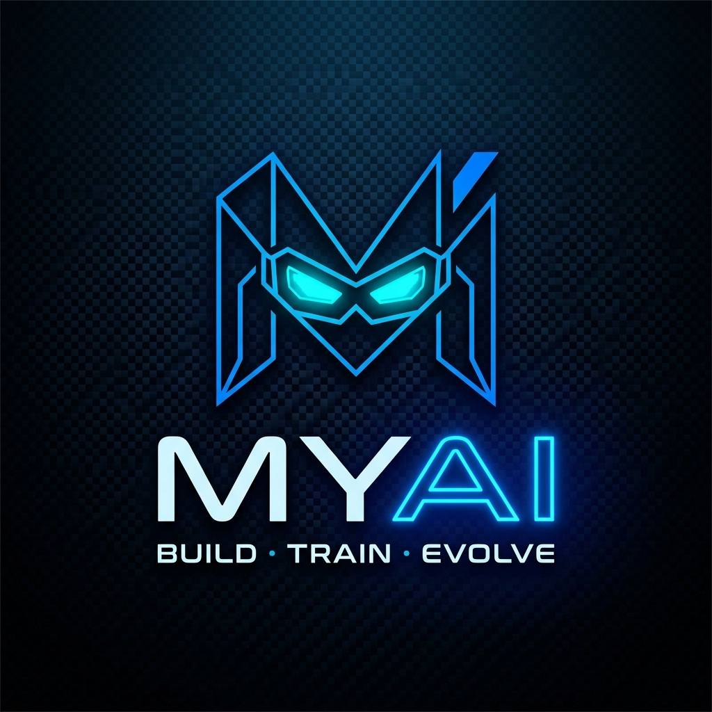

<p align="center">
  
</p>

<h1 align="center">MYAI</h1>

<p align="center">
  <strong>The Local-First Autonomous AI Model Builder & Zero-Dependency Packager.</strong><br>
  <em>BUILD · TRAIN · EVOLVE</em>
</p>

<p align="center">
  <a href="#-quickstart-in-3-commands">Quick Start</a> &middot;
  <a href="#-why-myai">Why MYAI?</a> &middot;
  <a href="#-key-capabilities">Capabilities</a> &middot;
  <a href="#-supported-models--hardware-tiers">Models & Hardware</a> &middot;
  <a href="#-cli-command-reference">Commands</a> &middot;
  <a href="#-18-point-security-gate">Security Gate</a> &middot;
  <a href="#-running-your-exported-model">Web Chat UI</a>
</p>

<p align="center">
  
  
  
  
  
  
  
  
</p>

---

Tell MYAI what AI you want. MYAI understands your **goal**, your **hardware**, and your **data** — then automatically plans, cleans, fine-tunes, evaluates, optimizes, and packages your custom model into a standalone, portable ZIP with its own Luminous Web & CLI Chat UI or GGUF format for Ollama.

No cloud GPUs required. Zero data leakage. No framework lock-in.

---

## ⚡ Quickstart in 3 Commands

```bash
# 1. Initialize your project with an interactive Goal Profile
myai init fitness-coach

# 2. Add your data in-place (JSONL, JSON, CSV)
cd fitness-coach
myai data add ./workouts.jsonl

# 3. Autopilot: Goal → Hardware → Data → Train → Eval → Optimize → Export
myai auto --export
```

```text
[1] 🎯 Goal: domain-qa / fitness
[2] 🖥️ Hardware: NVIDIA GeForce RTX 3060 · tier T2
[3] 📊 Data: 1,420 samples · quality 92/100 · dup 0.0%
[4] 🧠 Model: Qwen 2.5 (1.5B) · LoRA / QLoRA
[5] ⚖️ Feasibility: PASS · est 3.8 GB VRAM
[6] ⚙️ Strategy: 4bit r16 · 3 ep · ~4.2 min · 0.8 GB storage
[7] 🏗️ Training: run-001 · 4.1 min
[8] 🏆 Leaderboard: run-001 → 87.4/100 composite
[9] 🔧 Optimizer: improved → run-002 (89.6/100)
[10] 🛡️ Ship Gate: 4/4 offline regression suites passed → SHIP
[11] 📦 Export: 18/18 security gate passed → fitness-coach.myai.zip
🎉 YOUR AI IS READY
```

---

## 💡 Why MYAI?

Building and deploying fine-tuned models is traditionally fragmented between manual script writing, CUDA OOM troubleshooting, separate evaluation frameworks, and complex serving infrastructure. MYAI unifies the entire stack into an **autonomous local pipeline**:

- 🔒 **100% Local & Air-Gapped**: Zero cloud lock-in. No telemetry. Strict Reference Mode ensures raw datasets are never modified or uploaded.
- 🌊 **Exact Layer Streaming (8B on 4GB VRAM)**: Streams base decoder layers from host RAM/disk to GPU buffers on demand, keeping peak VRAM under **~3.32 GB**.
- 🎯 **Post-Training Alignment Zoo**: Direct preference tuning with **DPO, ORPO, SimPO, and KTO**.
- 🧠 **Deterministic Reward Synthesis (`myai reward synth`)**: Ingests reference outputs and automatically synthesizes calibrated, deterministic Python verifiers (`numeric`, `json_schema`, `regex`, `tool_call`).
- 🛡️ **Leg-2 Regression Ship Gate (`myai ship`)**: 4 bundled offline test suites (JSON validity, tool calling, arithmetic, safety refusals) issuing cryptographic SHIP / DON'T-SHIP verdicts.
- 📦 **Zero-Dependency Web App ZIP & GGUF Export**: Generates self-contained packages containing their own built-in `http.server` Luminous Web Chat UI and Ollama `Modelfile`s.

---

## 🌟 Key Capabilities


### 1. 🎯 Goal Understanding & Composite Metric Weighting (Stage A)
Define your AI's task and domain (`chat`, `code`, `domain-qa`, `summarization`, `extraction`, `reasoning`). MYAI automatically computes goal-weighted evaluation matrices (BLEU, ROUGE, readability, domain accuracy, exact match) so "best" is measured against your actual goal, not generic averages.

### 2. 🧹 Dataset Intelligence & Strict Reference Mode (Stage B)
* **Strict Reference Mode**: Original data files are **never modified** ($MD5_{\text{before}} = MD5_{\text{after}}$).
* **PII & Secret Scrubbing**: Redacts emails, phone numbers, OpenAI (`sk-`), HuggingFace (`hf_`), GitHub (`ghp_`), and AWS credentials.
* **Exact & Fuzzy Deduplication**: SequenceMatcher and MD5 hashing eliminate sample redundancy.
* **Leakage Detection**: Automatically isolates train/validation contamination before training starts.

### 3. ⚖️ Dual-Gate Feasibility & Layer Streaming (Stage C)
* **Empirical VRAM Modeling**: Accurately computes base model weights, KV cache, activation memory, LoRA adapter states, and CUDA allocator headroom.
* **Layer Streaming Auto-Activation**: On 4GB laptop GPUs, activates Layer Streaming to fit 8B parameter models safely.

### 4. 🏗️ Training & Alignment Engine (Stage D)
* **SFT Fine-Tuning**: LoRA & QLoRA (4-bit NF4 / 8-bit).
* **Preference Alignment Zoo**: DPO, ORPO, SimPO, and KTO.

### 5. 🔧 Autonomous Optimizer Loop (Stage E)
* Diagnoses metric deficiencies in the top release candidate.
* Prescribes minimal strategy mutations (LR, LoRA rank, sequence length, epochs) and retrains with an **Improvement Justified Gate** (`Δ >= min_delta`).

### 6. 🛡️ Leg-2 Regression Ship Gate & 18-Point Export Gate (Stage F)
* Validates model against 4 bundled offline reasoning and safety suites (`myai ship`).
* Packages the model through an **18-point containment gate** into a standalone ZIP or GGUF (Ollama).

---

## 🖥️ Supported Models & Hardware Tiers

| Hardware Tier | Available Memory | Recommended Models | Supported Methods |
| :--- | :--- | :--- | :--- |
| **Tier T0 (CPU)** | 8GB–16GB RAM | Qwen 2.5 / SmolLM2 (0.1B–1B) | CPU Simulation / LoRA |
| **Tier T1 (Low VRAM)** | **4GB GPU** (Laptop / GTX 1650) | **Llama 3.1 (8B)**, Qwen 3 (4B/8B), Gemma 3 (4B) | **Exact Layer Streaming**, QLoRA 4-bit |
| **Tier T2 (Mid VRAM)** | **8GB–16GB GPU** (RTX 3060 / 4070) | Llama 3.1 (8B), Qwen 3 (8B/14B), Phi-4 (14B), Ministral 3 (8B/14B) | Resident QLoRA 4-bit / 8-bit, DPO, SimPO |
| **Tier T3 (High VRAM)**| **24GB+ GPU** (RTX 3090 / 4090 / A100) | Mistral Small (24B), Qwen 3 (32B), Llama 3.1 (70B) | FP16 LoRA, Full QLoRA, Multi-Task Alignment |

> 📖 **Full Hardware Requirements Catalog**: See [`docs/hardware_catalog.md`](docs/hardware_catalog.md) for memory planning, active/total parameters, and fine-tuning targets for 0.1B to 675B+ MoE models.

---

## 🧭 Step-by-Step Workflow

### 1. Initialize Project & Set Goal
```bash
myai init my-assistant
cd my-assistant
```

This sets up `myai.yaml` with your project goal and evaluation weights.

### 2. Check Project Status Anytime

```bash
myai status
```

```text
┌────────────────────────────────────────────────────────┐
│ 📊 Project: my-assistant                               │
│ State: DATA_READY (2/5 stages complete)                │
│ Goal: chat / general                                   │
│ Dataset: 500 samples (train.jsonl)                     │
│ Next Step: Run 'myai train' or 'myai auto'             │
└────────────────────────────────────────────────────────┘
```

### 3. Add and Clean Data (Reference Mode)

```bash
# Register dataset source and run Tokenizer Analysis
myai data add ./data.jsonl

# Clean, deduplicate, scrub PII, and split train/val
myai data clean --fuzzy --val-split 0.1
```

### 3. Benchmark Hardware & Recommend Model
```bash
myai system check
myai recommend
```

### 4. Train Model (or Train with Layer Streaming / Alignment)
```bash
# Standard training
myai train --epochs 3 --lr 2e-4

# Train 8B model on 4GB laptop GPU with Exact Layer Streaming
myai train --stream-layers

# Train direct preference alignment (SimPO or DPO)
myai train --task simpo
```

### 5. Synthesize Deterministic Verifiers (`reward synth`)
```bash
myai reward synth ./data/references.jsonl -o reward.py --output-report calib.json
```

### 6. Run Leg-2 Regression Ship Gate
```bash
myai ship
```

### 7. Export Standalone Package
```bash
# Export as standalone zero-dependency Web Chat ZIP
myai export

# Export to GGUF for Ollama & llama.cpp
myai export --format gguf --quant q4_k_m

# Merge LoRA adapter into standalone base weights
myai merge
```

---

## 🚀 Running Your Exported Model

The exported `.zip` contains a self-contained runtime that requires **zero MYAI code**:

```text
my-assistant.myai.zip
├── model/                  # LoRA adapter weights (adapter_model.bin / safetensors)
├── tokenizer/              # Tokenizer configuration & vocab
├── metadata.json           # Model provenance, base repo, and goal details
├── evaluation.json         # Goal-weighted evaluation scores
├── loader.py               # Zero-framework inference helper
└── chat/
    ├── app.py              # Zero-dependency local web server (http.server)
    ├── ui.py               # Terminal fallback UI
    ├── config.json         # UI configuration & branding
    └── web/
        └── index.html      # Luminous Web Chat interface
```

### Launch Luminous Web Chat UI (Default)
```bash
python chat/app.py
```
* Runs on Python's built-in `http.server` (requires zero pip dependencies).
* Opens a modern, dark-mode ambient interface in your browser.
* Includes animated thinking state, parameter controls, and message history.

---

## 🛡️ 18-Point Security Gate

Before any export is written to disk, `myai` enforces strict containment:

| # | Security Check | Description |
| --- | --- | --- |
| **1** | Archive Integrity | Valid non-corrupt ZIP structure |
| **2** | Model Weights | `model/` directory with valid adapter binaries |
| **3** | Tokenizer | `tokenizer/` configuration present |
| **4** | Metadata | `metadata.json` present with base repo provenance |
| **5** | Evaluation | `evaluation.json` with verified metric scores |
| **6** | Documentation | Standalone `README.md` included |
| **7** | Portable Loader | Self-contained `loader.py` inference script |
| **8** | Standalone Chat | Full `chat/app.py`, `chat/ui.py`, `chat/web/index.html` runtime |
| **9** | **Source Isolation** | 🚫 Zero MYAI source code (`src/`, `myai/`) |
| **10** | **Version Control** | 🚫 Zero `.git/` directories or history |
| **11** | **Environment Files** | 🚫 Zero `.env` or environment configuration files |
| **12** | **Secret Scrubbing** | 🚫 Zero API keys (`sk-`, `ghp_`, `hf_`, `AKIA`) in metadata |
| **13** | **Dataset Privacy** | 🚫 Zero raw training datasets (`.jsonl`, `.csv`, `.parquet`) |
| **14** | **Model Isolation** | 🚫 Zero unrelated model weights |
| **15** | **Cache Cleanliness** | 🚫 Zero `__pycache__`, `.pyc`, `.DS_Store`, or temp files |
| **16** | **Host Path Privacy** | 🚫 Zero raw absolute host filesystem paths |
| **17** | **Traversal Protection** | 🚫 Zero path-traversal entries (`../`, absolute paths) |
| **18** | **Atomic Packaging** | Package generated and validated atomically |

---

## 🛠️ CLI Command Reference

| Command | Description |
| --- | --- |
| `myai init [name]` | Initialize a new project with interactive Goal Profile interview |
| `myai status` | Inspect project lifecycle status and recommended next steps |
| `myai system check` | Probe local CPU, RAM, GPU, VRAM, and throughput benchmark |
| `myai auto [--export] [--dry-run]` | **Autopilot**: Goal-to-Deployment autonomous pipeline |
| `myai data add <path> [--model]` | Register local dataset sources in Reference Mode & run tokenizer analysis |
| `myai data tokenize [--dataset] [--model] [--path]` | **Tokenizer Analysis**: Compute exact tokens, distributions & context fit |
| `myai data clean [--fuzzy] [--val-split]` | Clean, deduplicate, scrub PII, and split datasets |
| `myai data list` / `info` | Inspect registered datasets, sample counts, and quality scores |
| `myai recommend` | Hardware- and goal-aware base model recommendation |
| `myai train [--stream-layers] [--task]` | Train model with live metrics, **Exact Layer Streaming**, or **DPO/ORPO/SimPO** alignment |
| `myai reward synth <refs> -o <out.py>` | **Reward Synth**: Infer and synthesize calibrated deterministic Python verifiers |
| `myai ship [--base] [--adapter]` | **Ship Gate**: Run 4-suite Leg-2 offline regression gate for SHIP / DON'T-SHIP verdict |
| `myai merge [--adapter] [--base]` | Merge LoRA adapter weights directly into standalone base model checkpoint |
| `myai runs list` / `info <id>` | List historical training runs and metric breakdowns |
| `myai runs best` / `leaderboard` | View experiment leaderboard and release candidate |
| `myai optimize [--dry-run] [--max-iters]` | Autonomous retrain/compare optimization loop |
| `myai export [--format gguf\|zip\|merged]` | Package as standalone Web App ZIP, **GGUF (Ollama)**, or Merged weights |
| `myai serve` / `myai ask` | Serve local model with Knowledge Gate RAG protection |

---

## 🧪 Comprehensive Test Suite

MYAI is verified by **203 automated tests** covering unit, integration, tokenizer streaming, preference losses, layer streaming, reward synthesis, regression gates, and security audit scenarios:

```bash
# Run all tests
pytest -v

# Run the dedicated 42-point security and reliability audit
pytest tests/test_security_audit.py -v

# Run the Soup-inspired capabilities test suite
pytest tests/test_soup_features.py -v
```

```text
============================ 203 passed in 12.01s =============================
```

---

## 📜 License

Distributed under the **Apache 2.0** License. See [LICENSE](file:///e:/CMD%20GitHub/myai/LICENSE) for details.
